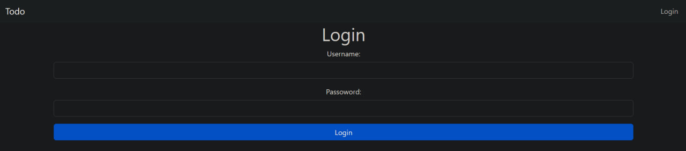
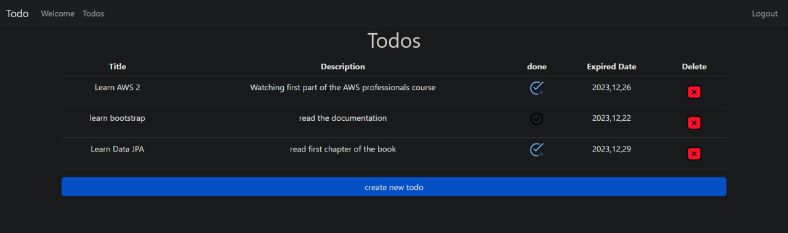
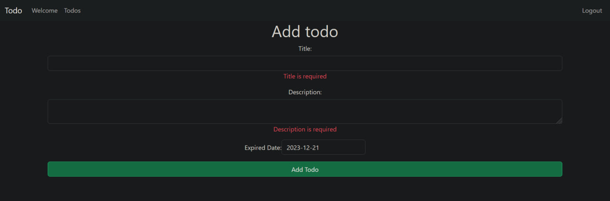
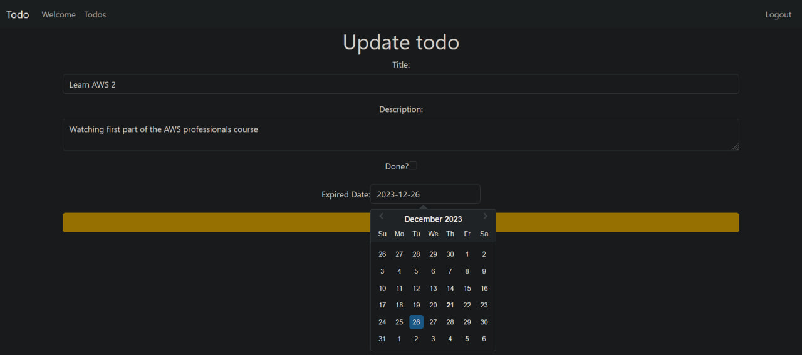
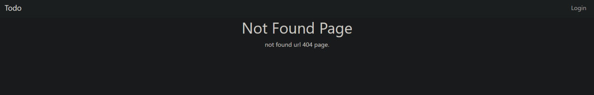

# Todo App

## Task
  - There is Auth (Login & Logout)
  - Store the Token
  - todos:
    - List
    - Create
  - todo:
    - Delete
    - Update
    - View
  - Link with Api to Auth and deal with todos
  - Validate forms (to user experince & reduce number of requests to the API)

## Tools
  - ReactJs
  - Html & Css & Bootstrap
  - Axios
  - React Router
  - yup & Formik

## Main Screens

### Login 

### Todos List 

### Create Todo 

### Update 

### Not Found
